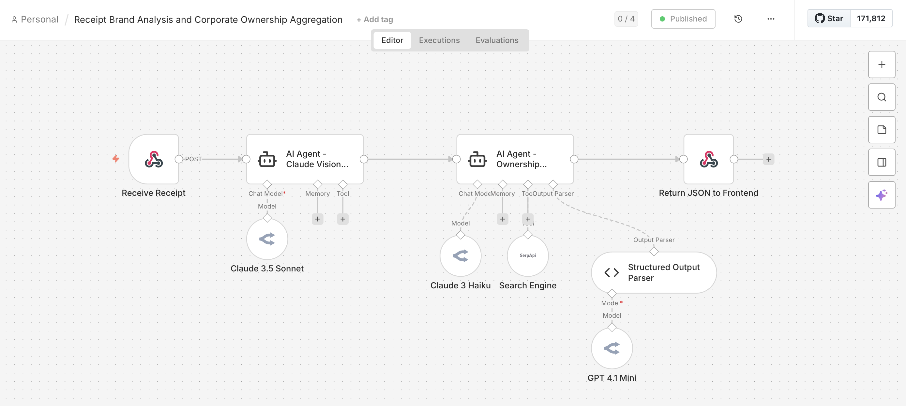
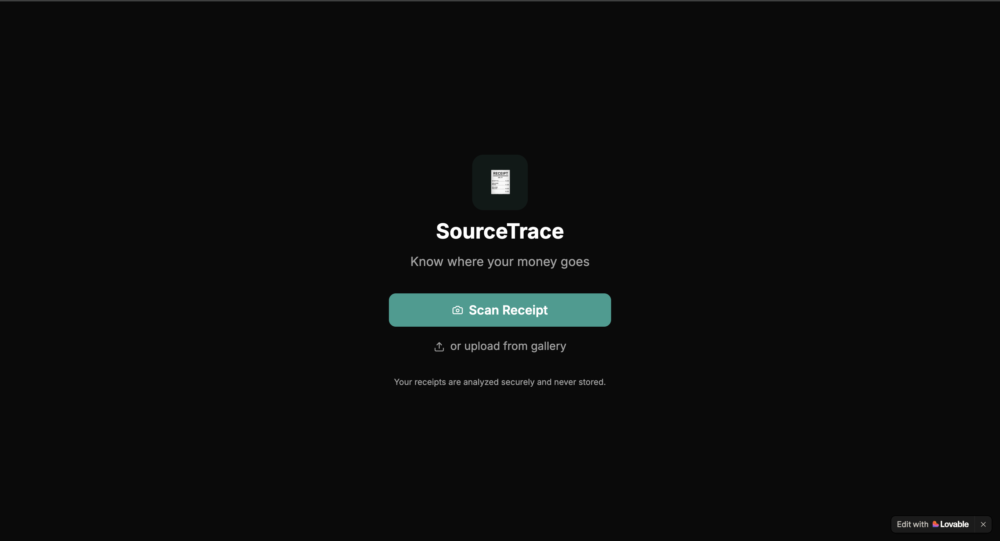
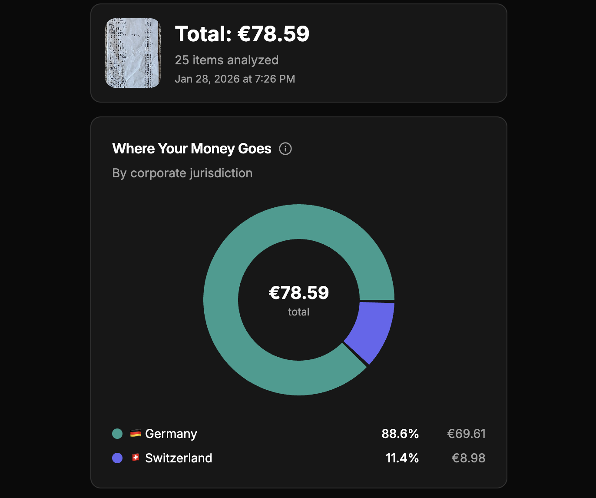
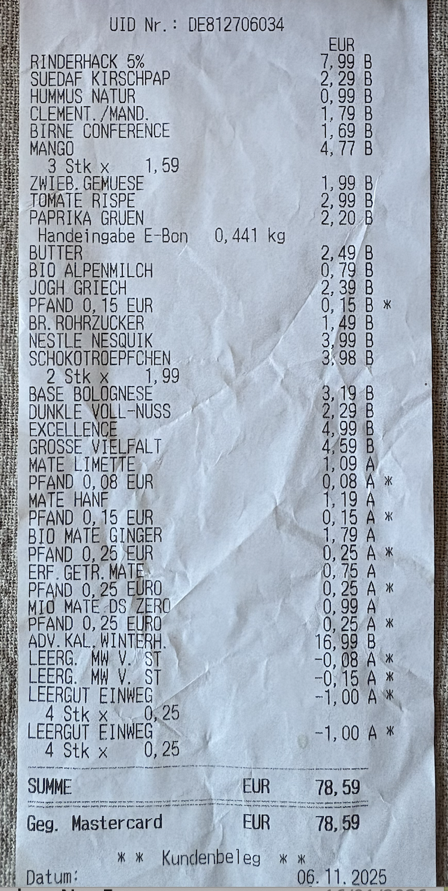

# SourceTrace 🧾

**See where your money really goes.**

SourceTrace scans grocery receipts and reveals the corporate ownership behind every product you buy — showing which countries and companies ultimately profit from your purchases.

> **Built by [Julian Sauer](https://www.linkedin.com/in/julian-s-ab95581b9)**

---

## 🚀 Live Demo & Workflow

| Resource | Link |
|----------|------|
| 🌐 **Live App** | [grocerysourcetrace.lovable.app](https://grocerysourcetrace.lovable.app) |
| 🔧 **n8n Workflow** | [backend/n8n-workflow.json](backend/n8n-workflow.json) |
| 💻 **GitHub Repo** | [github.com/JULIAN-SAUER-DEV/SourceTrace](https://github.com/JULIAN-SAUER-DEV/SourceTrace) |

---

## 🤖 AI Agent Architecture (n8n)

The core innovation is a **multi-step AI agent workflow** orchestrating multiple AI capabilities:

### n8n Workflow


### Agent Pipeline
```
┌─────────────────────────────────────────────────────────────────┐
│                        n8n AI AGENT WORKFLOW                     │
├─────────────────────────────────────────────────────────────────┤
│                                                                   │
│  ┌──────────┐    ┌──────────────┐    ┌──────────────────────┐   │
│  │ Webhook  │───▶│ Image        │───▶│ AI Agent 1:          │   │
│  │ Trigger  │    │ Preprocessing│    │ Receipt OCR          │   │
│  └──────────┘    └──────────────┘    │ (Claude Vision)      │   │
│                                       └──────────┬───────────┘   │
│                                                  │               │
│                                                  ▼               │
│                                       ┌──────────────────────┐   │
│                                       │ AI Agent 2:          │   │
│                                       │ Ownership Analysis   │   │
│                                       │ (Claude + SerpAPI)   │   │
│                                       └──────────┬───────────┘   │
│                                                  │               │
│                                                  ▼               │
│                                       ┌──────────────────────┐   │
│                                       │ Structured Output    │   │
│                                       │ Parser + Response    │   │
│                                       └──────────────────────┘   │
│                                                                   │
└─────────────────────────────────────────────────────────────────┘
```

### Key AI Agent Capabilities Demonstrated

| Capability | Implementation | Business Value |
|------------|----------------|----------------|
| **Vision AI Integration** | Claude 3.5 Sonnet processes receipt images | Eliminates manual data entry |
| **Multi-Agent Orchestration** | Separate agents for OCR vs. analysis | Optimized cost & reliability |
| **Tool-Augmented AI** | SerpAPI integration for real-time lookups | Accurate ownership data |
| **Structured Output Parsing** | JSON schema enforcement | Consistent frontend integration |
| **Error Handling** | Graceful fallbacks & retry logic | Production-ready reliability |
| **Prompt Engineering** | Domain-specific German retail knowledge | 90%+ accuracy on DACH receipts |

---

## 📱 Demo

### Landing Page


### Receipt Analysis Result


---

## 🎯 Problem Statement

When consumers buy groceries, they see brand names — but lack visibility into:
- Who actually owns these brands?
- Which country are they incorporated in?
- Who are the ultimate beneficial owners?


---

## 💡 Solution

I designed and built an end-to-end AI-powered pipeline that:
1. **Captures** receipt images via mobile-first web app
2. **Extracts** product data using Claude Vision AI
3. **Enriches** with corporate ownership data via intelligent agent workflows
4. **Visualizes** spending breakdown by corporate jurisdiction

---

## 📊 Example Output

### Input: Grocery Receipt


### Output: Ownership Analysis


| Product | Brand | Parent Company | Jurisdiction |
|---------|-------|----------------|--------------|
| Nesquik | Nesquik | Nestlé S.A. | 🇨🇭 Switzerland |
| G&G Mohren | Gut & Günstig | EDEKA Group | 🇩🇪 Germany |

---

## 🛠️ Technical Implementation

### System Architecture
```
┌─────────────┐     ┌─────────────┐     ┌─────────────┐
│   Lovable   │────▶│    n8n      │────▶│  Response   │
│  Frontend   │     │  Workflow   │     │   JSON      │
└─────────────┘     └──────┬──────┘     └─────────────┘
                           │
              ┌────────────┼────────────┐
              ▼            ▼            ▼
        ┌──────────┐ ┌──────────┐ ┌──────────┐
        │  Claude  │ │ SerpAPI  │ │Open Food │
        │  Vision  │ │ Lookup   │ │  Facts   │
        └──────────┘ └──────────┘ └──────────┘
```

### Tech Stack

| Layer | Technology | Why This Choice |
|-------|------------|-----------------|
| Frontend | React ([Lovable](https://grocerysourcetrace.lovable.app)) | Rapid prototyping, mobile-first |
| Workflow Engine | **n8n** | Visual AI agent orchestration |
| OCR | Claude 3.5 Sonnet Vision | Best-in-class document understanding |
| Enrichment | Claude + SerpAPI | Real-time ownership verification |
| LLM Gateway | OpenRouter | Model flexibility, cost optimization |
| Hosting | Lovable Cloud + n8n Cloud | Zero DevOps overhead |

---

## ✨ Features Delivered

- 📸 **Receipt Scanning** — Upload or photograph any grocery receipt
- 🏢 **Corporate Ownership** — Identifies parent companies for each product
- 🌍 **Jurisdiction Mapping** — Shows country of legal incorporation
- 📊 **Spend Breakdown** — Visual chart of where your money flows
- 🇩🇪 **German Market Focus** — Optimized for EDEKA, REWE, Lidl, Aldi receipts

---

## 📈 Research-Driven Development

This project began with **deep market research** into German consumer behavior:

| Insight | Statistic | Source |
|---------|-----------|--------|
| Regional product preference | 77% | BMEL 2024 |
| Nutri-Score awareness | 88% | BMEL 2024 |
| Sustainable market share (DE) | 42% | NYU Stern |
| Sustainable market share (US) | 23.8% | NYU Stern |
| Label reading behavior | 75% actively read labels | NSF Germany 2024 |

**Key finding:** No existing tool combined receipt scanning with corporate ownership data — a clear market gap.


## 👤 Author

**Julian Sauer** — Program Manager

- 💼 LinkedIn: [julian-s](https://www.linkedin.com/in/julian-s-ab95581b9)
- 💻 GitHub: [@JULIAN-SAUER-DEV](https://github.com/JULIAN-SAUER-DEV)


---

## 🙏 Acknowledgments

- [n8n](https://n8n.io) — Workflow automation platform
- [Lovable](https://lovable.dev) — AI-powered frontend development
- [Anthropic](https://anthropic.com) — Claude Vision API
- [OpenRouter](https://openrouter.ai) — LLM gateway

---

<p align="center">
  <b>Built as a proof of concept for consumer transparency tools.</b><br>

---

## 🔗 Quick Links

| | |
|---|---|
| 🌐 **Try it live** | [grocerysourcetrace.lovable.app](https://grocerysourcetrace.lovable.app) |
| 🔧 **n8n Workflow** | [backend/n8n-workflow.json](backend/n8n-workflow.json) |
